# Multimedia Portfolio Website

This is a responsive website designed to showcase multimedia services such as video production and audio recording.
The site includes multiple pages and uses CSS Grid and Flexbox for layout.

---

## Issues Found (Debugging Log)

### Issue 1: Duplicate CSS Selectors

- Problem: Multiple conflicting `.top` styles in stylesheet
- Impact: Overriding layout styles unexpectedly
- Fix: Merged duplicate selectors into single definition

---

### Issue 2: Grid Layout Breaks on Mobile

- Problem: Fixed `grid-template-columns` caused overflow
- Impact: Horizontal scrolling on mobile devices
- Fix: Added media queries with `1fr` layout fallback

---

### Issue 3: Form Validation Not Visible

- Problem: Missing border styles on input fields
- Impact: Users could not see validation feedback
- Fix: Added `:valid` and `:invalid` styles

---

### Issue 4: Accessibility Gaps

- Problem: Missing focus states on interactive elements
- Impact: Keyboard navigation unclear
- Fix: Added `:focus` styles to buttons and links

---

## Features

- Responsive layout using CSS Grid and Flexbox
- Navigation bar with active page indicator (`aria-current="page"`)
- Portfolio gallery using CSS Grid with hover effects
- Contact form with validation and checkbox subscription option
- Video showcase with multiple sources (MP4/WebM), poster images, and caption tracks (.vtt)
- Audio player with multiple sources (MP3/OGG) and fallback text
- Client testimonials with figure and figcaption elements (6+ images total)
- Embedded Google Maps iframe with lazy loading
- Animated UI elements including hover effects and transitions
- Favicon support across browsers and devices (SVG, PNG, ICO, Apple touch icon)
- `prefers-reduced-motion` media query for accessibility

---

## Coding Conventions

- BEM-style naming used for reusable components (e.g. `.portfolio-grid`, `.contact-form`)
- Semantic HTML used (header, main, section, article, footer)
- Mobile-first responsive design using media queries
- CSS structured by page sections (Home, About, Media, Contact)
- Consistent indentation (2 spaces)
- No inline styles used
- Reusable utility classes used where possible

---

## Accessibility

- Semantic HTML5 landmarks used (header, main, footer)
- `aria-current="page"` on active navigation links
- `aria-label` on navigation, buttons, and media elements
- `iframe` title attribute for screen reader support
- Video captions via `.vtt` files using `<track>` elements
- Focus states on interactive elements

---

## Technologies Used

- HTML5
- CSS3 (Flexbox and Grid)
- Basic form validation using HTML and CSS

---

## Project Structure

/fix-and-complete-advanced-html-structure-ItumelengMphuti
│── index.html
│── about.html
│── media.html
│── contact.html
│── /css
│ └── styles.css
│── /images
│── /media
│ ├── video1.mp4
│ ├── video1.webm
│ ├── video2.mp4
│ ├── video2.webm
│ ├── audio.mp3
│ ├── audio.ogg
│ ├── video1.vtt
│ └── video2.vtt
│── /screenshots

---

## Design Decisions

- CSS Grid was used for page layouts to create structured sections.
- Flexbox was used for smaller components like the navigation and cards.
- Reusable classes like `.card` and `.portfolio` were used to maintain consistency.
- Media queries to ensure responsiveness on smaller screens.

---

## Cross-browser Compatibility

- Used `-webkit-` properties for gradient text support
- Added fallback colors for unsupported browsers
- Tested layout in multiple browsers (Chrome, Edge)

---

## Challenges

- Duplicate CSS selectors caused style conflicts.
- Input validation styles were not visible due to missing borders.
- Grid layout placement issues using `nth-of-type`.

---

## Solutions

- Merged duplicate CSS rules.
- Added border styling for form inputs.
- Adjusted layout structure and selectors.

---

## How to Run

1. Download or clone the repository
2. Open `index.html` in a browser
3. Navigate through pages using the navbar

---

## Future Improvements

- Add JavaScript for form submission
- Improve accessibility
- Add backend integration for contact form
- Optimize images and performance

---

## Screenshots

### Pages on desktop

Home Page
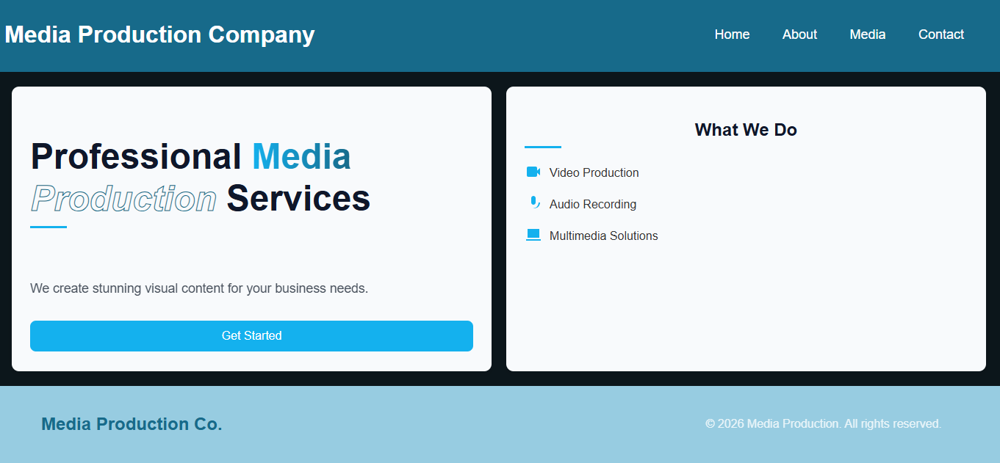

About Page
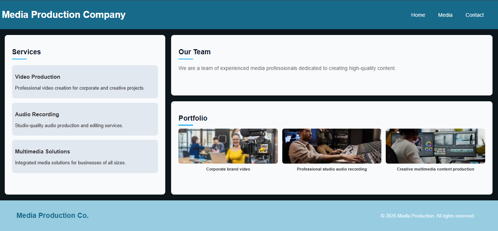

Media Page
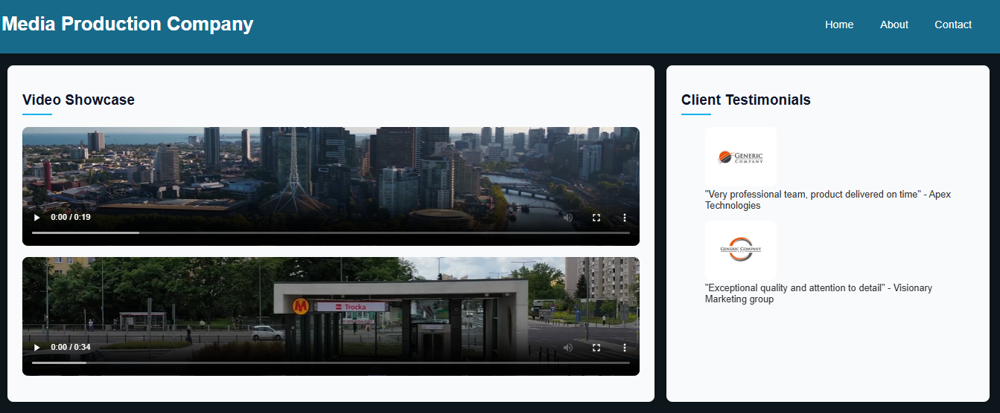
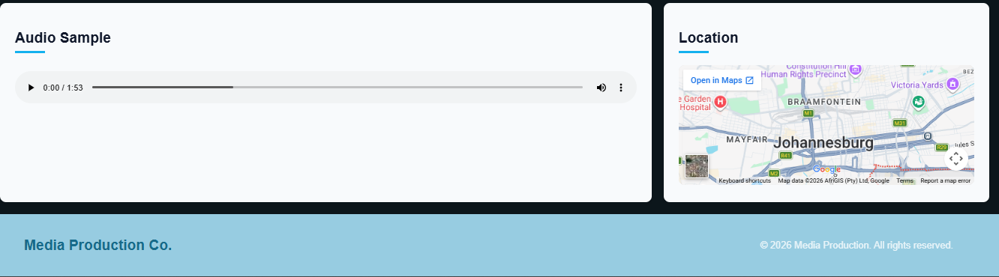

Contact Page
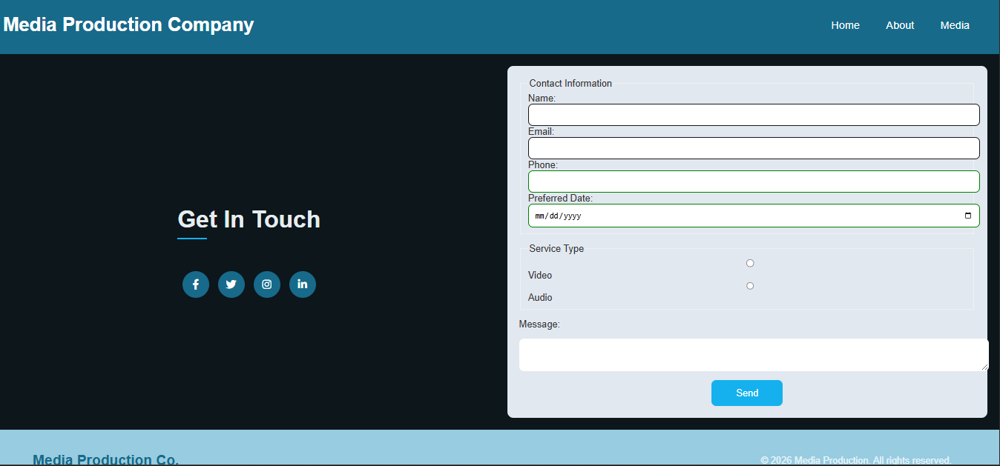

### Page mobile view

Home Page - Mobile View
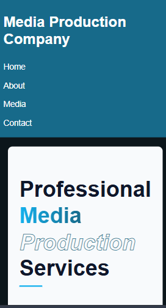
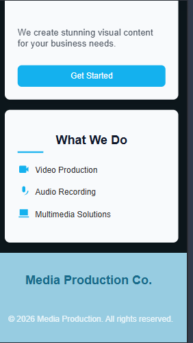

Contact Page - Mobile View

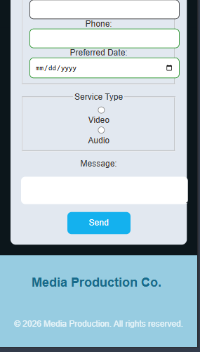

## Form Validation

## Effects

[View Effects Video](screenshots/effects.mp4)

### Media Elements

[View Media Elements Video](screenshots/media-elements.mp4)

### Flexbox Layout

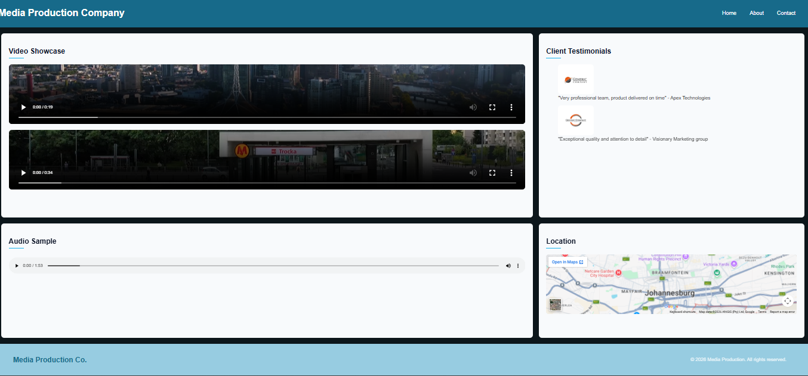

### CSS Grid Layout

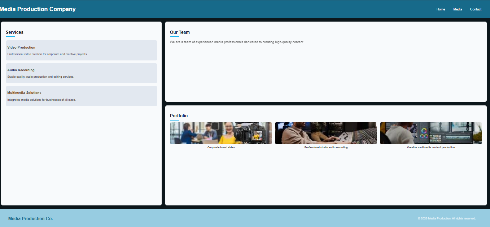

### Browser Compatibility

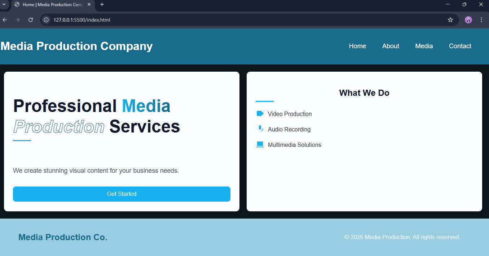
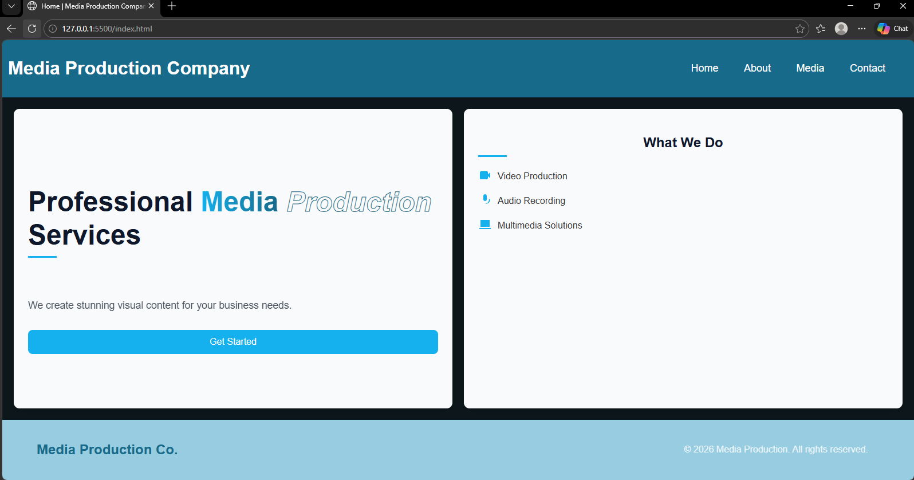

## CSS Validator

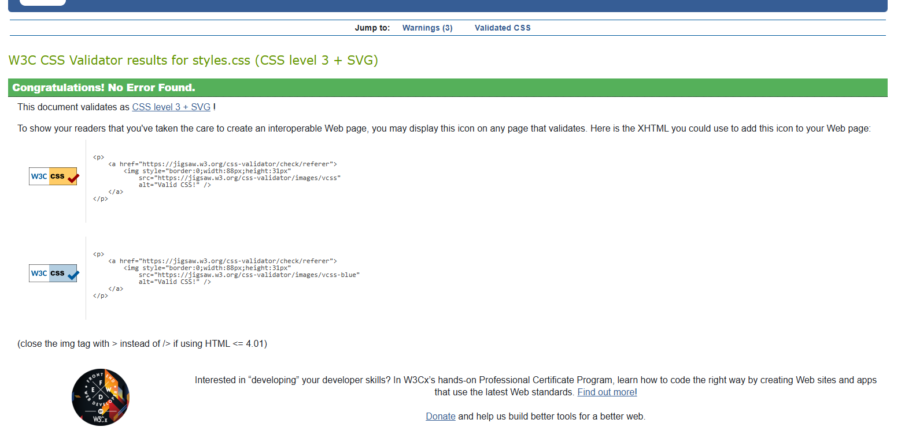

## HTML Validator

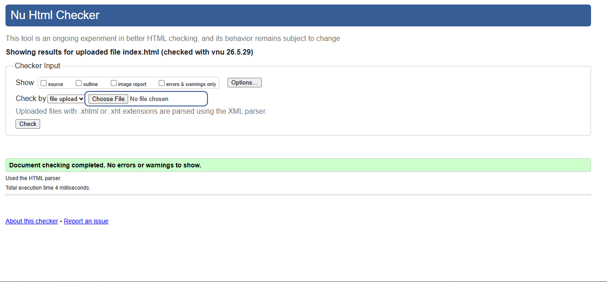
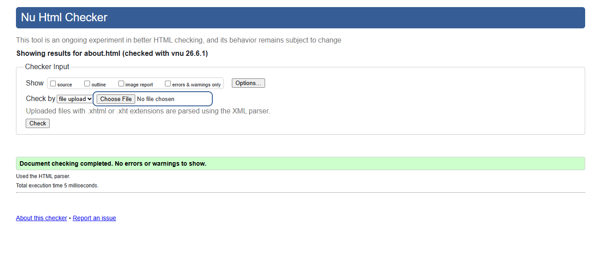
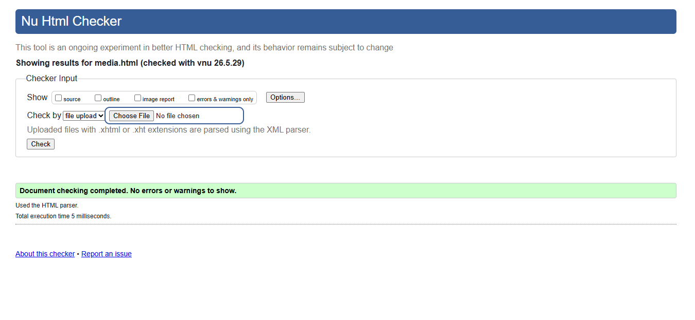
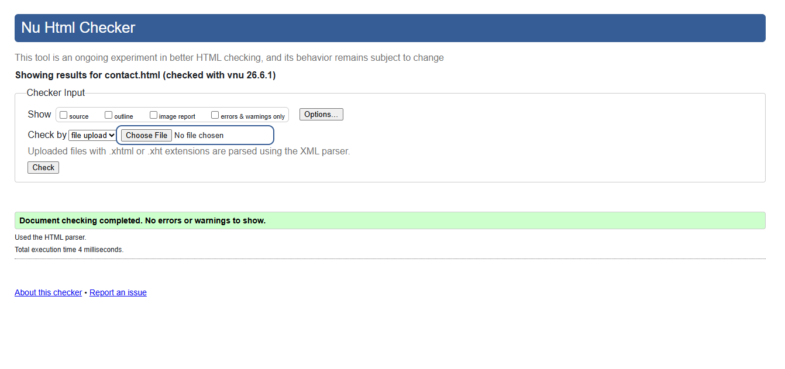
